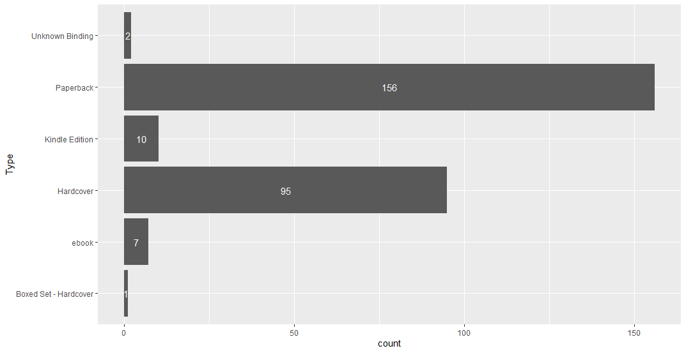
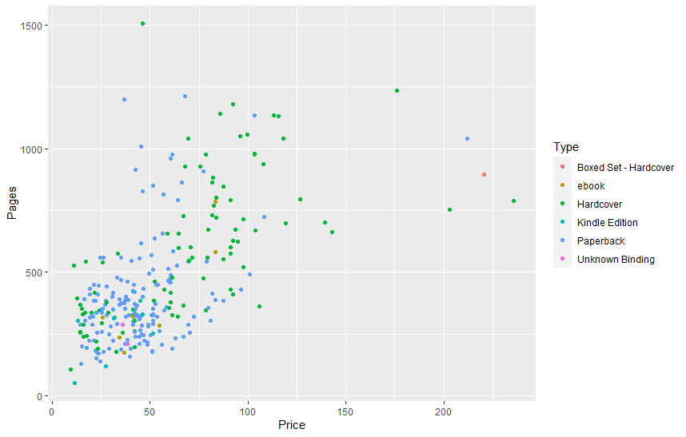

# R-Assignment 4

**Created by Wisarut-Ampaisuwan (ID: 63130500146)**

Choose Dataset:
1. Top 270 Computer Science / Programing Books (Data from Thomas Konstantin, [Kaggle](https://www.kaggle.com/thomaskonstantin/top-270-rated-computer-science-programing-books)) >> [Using CSV](https://raw.githubusercontent.com/safesit23/INT214-Statistics/main/datasets/prog_book.csv)
### Outlines
1. Explore the dataset
2. Learning function from Tidyverse
3. Transform data with dplyr and finding insight the data
4. Visualization with GGplot2

## Part 1: Explore the dataset

```
#library
library(readr)
library(ggplot2)
library(dplyr)
library(forcats)

#dataset
com_sci <- read_csv("https://raw.githubusercontent.com/safesit23/INT214-Statistics/main/datasets/prog_book.csv")

```
```
glimpse(com_sci)

Rows: 271
Columns: 7
$ Rating          <dbl> 4.17, 4.01, 3.33, 3.97, 4.06, 3.84, 4.09, 4.15, 3.87, 4.62, 4.0~
$ Reviews         <dbl> 3829, 1406, 0, 1658, 1325, 117, 5938, 1817, 2093, 0, 160, 481, ~
$ Book_title      <chr> "The Elements of Style", "The Information: A History, a Theory,~
$ Description     <chr> "This style manual offers practical advice on improving writing~
$ Number_Of_Pages <dbl> 105, 527, 50, 393, 305, 288, 256, 368, 259, 128, 352, 352, 200,~
$ Type            <chr> "Hardcover", "Hardcover", "Kindle Edition", "Hardcover", "Kindl~
$ Price           <dbl> 9.323529, 11.000000, 11.267647, 12.873529, 13.164706, 14.188235~
```
In this dataset has 271 observations and 7 variables
## Part 2: Learning function from Tidyverse
- คำสั่ง fct_count จาก package forcats จะทำหน้าที่ในการนับค่าที่มีอยู่ใน levels นั้นๆ
```
fct_count(factor(com_sci$Type))
```
## Part 3: Transform data with dplyr and finding insight the data
### **1.หาค่าเฉลี่ยของราคาหนังสือทั้งหมดโดยเเยกตามประเภทของหนังสือ**
```
# ทำการปัดทศนิยมเพื่อนำไปหาค่าเฉลี่ย
com_sci$Price <- replace(com_sci$Price , 1:271 , round(com_sci$Price , 0))

Average_Price <- com_sci %>% group_by(Type)  %>%  summarise(mean(Price , na.rm = TRUE))
names(Average_Price)[2] <- 'Average'
Average_Price
```
Result:
```
  Type                  Average
  <chr>                   <dbl>
1 Boxed Set - Hardcover    220  
2 ebook                    51.3
3 Hardcover                70.1
4 Kindle Edition           32.2
5 Paperback                45.7
6 Unknown Binding          37
```
Explain : ค่าเฉลี่ยของหนังสือเเต่ละประเภทเป็นดังนี้
- Boxed Set - Hardcover    220  
- ebook                    51.3
- Hardcover                70.1
- Kindle Edition           32.2
- Paperback                45.7
- Unknown Binding          37


### **2.หาหนังสือที่ไม่มีคนรีวิวเลย**
```
No_Reviews <-com_sci %>% filter(Reviews == 0) %>% select(Book_title , Type , Price)
print(No_Reviews)
```
Result:
```
  Book_title                                            Type        Price
   <chr>                                                 <chr>       <dbl>
 1 Responsive Web Design Overview For Beginners          Kindle Edi~    11
 2 ZX Spectrum Games Code Club: Twenty fun games to cod~ Paperback      15
 3 Game Programming Golden Rules                         Paperback      19
 4 Beginners Guide On PHP Programming: Quick And Easy G~ Paperback      23
 5 Python Programming Books Set: Python Programming for~ Paperback      24
 6 Your First App: Node.js                               ebook          26
 7 Python Programming For Beginners: Quick And Easy Gui~ Paperback      29
 8 Building an FPS Game with Unity                       Paperback      51
 9 Advanced Game Programming: A Gamedev.Net Collection   Paperback      59
10 Basic Proof Theory                                    Hardcover      60
# ... with 12 more rows
```
Explain: จากการสำรวจพบว่ามีหนังสือ 22 เล่มที่ไม่ได้รับการรีวิวเลย


### **3.หาหนังสือที่ได้ rating สูงกว่า 3.5 เเละมีคนรีวิวเกิน 1000 คน**
```
High_Rating <- com_sci %>% 
  filter(Rating > 3.5 & Reviews > 1000) %>% 
  select(Book_title , Description , Type , Price)
print(High_Rating)
```

Result:
```
  Book_title                          Description                          Type    Price
   <chr>                               <chr>                                <chr>   <dbl>
 1 The Elements of Style               "This style manual offers practical~ Hardco~     9
 2 The Information: A History, a Theo~ "James Gleick, the author of the be~ Hardco~    11
 3 Ghost in the Wires: My Adventures ~ "If they were a hall of fame or sha~ Hardco~    13
 4 How Google Works                    "Both Eric Schmidt and Jonathan Ros~ Kindle~    13
 5 Start with Why: How Great Leaders ~ "Why do you do what you do?\n\nWhy ~ Hardco~    14
 6 Algorithms to Live By: The Compute~ "A fascinating exploration of how i~ Hardco~    14
 7 Weapons of Math Destruction: How B~ "A former Wall Street quant sounds ~ Hardco~    15
 8 Superintelligence: Paths, Dangers,~ "Superintelligence asks the questio~ Hardco~    16
 9 The Innovators: How a Group of Hac~ "The computer and the internet are ~ Hardco~    17
10 The Code Book: The Science of Secr~ "In his first book since the bestse~ Paperb~    19
11 The Phoenix Project: A Novel About~ "Bill is an IT manager at Parts Unl~ Hardco~    24
12 Chaos: Making a New Science         "A work of popular science in the t~ Paperb~    26
13 The Goal: A Process of Ongoing Imp~ "Written in a fast-paced thriller s~ Paperb~    37
```
Explain: หนังสือเหล่านี้เป็นหนังสือที่ได้รับเรตติ้งที่สูงเเละมีจำนวนคนรีวิวเยอะ

### **4.หาหนังสือที่มีจำนวนหน้ามากกว่า 3000 หน้า**
```
com_sci %>% filter(Number_Of_Pages > 3000) %>% select(Book_title , Number_Of_Pages , Type , Price)
```
Result:
```
 Book_title                                              Number_Of_Pages Type      Price
  <chr>                                                             <dbl> <chr>     <dbl>
1 The Art of Computer Programming, Volumes 1-4a Boxed Set            3168 Hardcover   220
```
Explain: หนังสือเรื่อง The Art of Computer Programming, Volumes 1-4a Boxed Set มีจำนวนหน้ามากกว่า 3000 หน้าโดยมี 3168 หน้า 

### **5.หา top 10 หนังสือที่มี Rating สูงที่สุด**
```
top_10 <- com_sci %>% arrange(desc(Rating)) %>% select(Book_title , Type , Price) %>% head(10)
print(top_10)
```

Result:
```
   Book_title                        Type    Price
   <chr>                             <chr>   <dbl>
 1 Your First App: Node.js           ebook      26
 2 The Art of Computer Programming,~ Hardco~   220
 3 Designing Data-Intensive Applica~ Paperb~    46
 4 Build Web Applications with Java~ Paperb~    42
 5 Fluent Python: Clear, Concise, a~ Paperb~    64
 6 ZX Spectrum Games Code Club: Twe~ Paperb~    15
 7 The Linux Programming Interface:~ Hardco~    46
 8 CLR via C# (Developer Reference)  Paperb~    66
 9 The Elements of Computing System~ Hardco~    41
10 Practical Object Oriented Design~ Paperb~    50
```
Explain: หนังสือ 10 เล่มนี้เป็นหนังสือที่มี Rating สูงที่สุดโดยที่อันดับ 1 เป็นหนังสือเเบบ e-book ทำให้มีราคาถูก

### 6.หาว่าหนังสือในเเต่ละประเภทมีกี่เล่ม 
```
Avg_Rating <- com_sci %>% group_by(Type) %>% summarise(mean(Rating , na.rm = TRUE)) 
names(Avg_Rating)[2] <- 'Average'

Avg_Rating$Average<-round(Avg_Rating$Average , 2)

count <- fct_count(factor(com_sci$Type))
names(count)[1] <- 'Type'
names(count)[2] <- 'count'

merge(Avg_Rating , count) 
```
Result:
```
                   Type Average count
1 Boxed Set - Hardcover    4.49     1
2                 ebook    4.29     7
3             Hardcover    4.06    95
4        Kindle Edition    4.02    10
5             Paperback    4.06   156
6       Unknown Binding    3.99     2
```
Explain: จากการสำรวจพบว่า
- หนังสือ Boxed Set - Hardcover มีต่าเฉลี่ยของ rating ที่ 4.49 เเละมีจำนวน 1 เล่ม
-  หนังสือ           ebook มีต่าเฉลี่ยของ rating ที่ 4.29 เเละมีจำนวน   7 เล่ม
-  หนังสือ       Hardcover มีต่าเฉลี่ยของ rating ที่ 4.06 เเละมีจำนวน  95 เล่ม
-  หนังสือ  Kindle Edition มีต่าเฉลี่ยของ rating ที่ 4.02 เเละมีจำนวน  10 เล่ม
-  หนังสือ       Paperback มีต่าเฉลี่ยของ rating ที่ 4.06 เเละมีจำนวน 156 เล่ม
-  หนังสือ Unknown Binding มีต่าเฉลี่ยของ rating ที่ 3.99 เเละมีจำนวน   2 เล่ม
## Part 4: Visualization with GGplot2
### **1.กราฟนี้จะแสดงให้เห็นถึงจำนวนของหนังสือแต่ละประเภทจาก dataset นี้**
```
Type <- com_sci %>% ggplot(aes( y = Type)) + geom_bar() 
Type <-Type + geom_text(aes(label = ..count..) , stat = "count" , position =  position_stack(vjust = 0.5) , color = "white" )

Type 
```

Result:



### **2.กราฟนี้จะระบุความสัมพันธ์ระหว่างราคาและจำนวนหน้าของหนังสือโดยแบ่งประเภทตามประเภทของหนังสือ**
```
page_graph <- com_sci %>% 
  filter(Number_Of_Pages < 3000 ) %>% 
  ggplot(aes(x = Price , y=Number_Of_Pages)) + geom_point(aes(color = Type), position = 'jitter' ) + ylab("Pages")

page_graph
```
Result:




