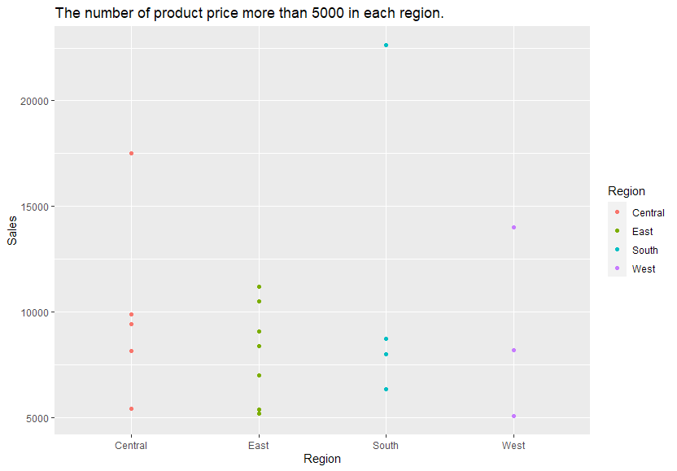

# R-Assignment 4

**Created by Supphakorn Praisakuldecha (ID: 63130500158)**

Choose Dataset: Superstore Sales Dataset (Data from Rohit Sahoo,[Kaggle](https://www.kaggle.com/rohitsahoo/sales-forecasting)) >> [Using CSV](https://raw.githubusercontent.com/safesit23/INT214-Statistics/main/datasets/superstore_sales.csv)


### Outlines
1. Explore the dataset
2. Learning function from Tidyverse
3. Transform data with dplyr and finding insight the data
4. Visualization with GGplot2

## Part 1: Explore the dataset

```
# Library
library(tidyverse)

# Dataset
Superstore <- read_csv("https://raw.githubusercontent.com/sit-2021-int214/030-IMDB-Movies/main/assignment/HW04/HW04_63130500158/SuperstoreSales.csv")
```

In this dataset has .....

```
glimpse(Superstore)

```

Rows: 9,800
Column:17

```
$ Row.ID        <int> 1, 2, 3, 4, 5, 6, 7, 8, 9, 10, 11, 12, 13, 14, 15, 16, 17, 18, 19, 20, 21, 22, 23, 24, 25, 26, 27, 28, 29, 30, 31, 32, 33, 34, ~
$ Order.ID      <chr> "CA-2017-152156", "CA-2017-152156", "CA-2017-138688", "US-2016-108966", "US-2016-108966", "CA-2015-115812", "CA-2015-115812", "~
$ Order.Date    <chr> "08/11/2017", "08/11/2017", "12/06/2017", "11/10/2016", "11/10/2016", "09/06/2015", "09/06/2015", "09/06/2015", "09/06/2015", "~
$ Ship.Date     <chr> "11/11/2017", "11/11/2017", "16/06/2017", "18/10/2016", "18/10/2016", "14/06/2015", "14/06/2015", "14/06/2015", "14/06/2015", "~
$ Ship.Mode     <chr> "Second Class", "Second Class", "Second Class", "Standard Class", "Standard Class", "Standard Class", "Standard Class", "Standa~
$ Customer.ID   <chr> "CG-12520", "CG-12520", "DV-13045", "SO-20335", "SO-20335", "BH-11710", "BH-11710", "BH-11710", "BH-11710", "BH-11710", "BH-117~
$ Customer.Name <chr> "Claire Gute", "Claire Gute", "Darrin Van Huff", "Sean O'Donnell", "Sean O'Donnell", "Brosina Hoffman", "Brosina Hoffman", "Bro~
$ Segment       <chr> "Consumer", "Consumer", "Corporate", "Consumer", "Consumer", "Consumer", "Consumer", "Consumer", "Consumer", "Consumer", "Consu~
$ Country       <chr> "United States", "United States", "United States", "United States", "United States", "United States", "United States", "United ~
$ City          <chr> "Henderson", "Henderson", "Los Angeles", "Fort Lauderdale", "Fort Lauderdale", "Los Angeles", "Los Angeles", "Los Angeles", "Lo~
$ State         <chr> "Kentucky", "Kentucky", "California", "Florida", "Florida", "California", "California", "California", "California", "California~
$ Postal.Code   <int> 42420, 42420, 90036, 33311, 33311, 90032, 90032, 90032, 90032, 90032, 90032, 90032, 28027, 98103, 76106, 76106, 53711, 84084, 9~
$ Region        <chr> "South", "South", "West", "South", "South", "West", "West", "West", "West", "West", "West", "West", "South", "West", "Central",~
$ Product.ID    <chr> "FUR-BO-10001798", "FUR-CH-10000454", "OFF-LA-10000240", "FUR-TA-10000577", "OFF-ST-10000760", "FUR-FU-10001487", "OFF-AR-10002~
$ Category      <chr> "Furniture", "Furniture", "Office Supplies", "Furniture", "Office Supplies", "Furniture", "Office Supplies", "Technology", "Off~
$ Sub.Category  <chr> "Bookcases", "Chairs", "Labels", "Tables", "Storage", "Furnishings", "Art", "Phones", "Binders", "Appliances", "Tables", "Phone~
$ Product.Name  <chr> "Bush Somerset Collection Bookcase", "Hon Deluxe Fabric Upholstered Stacking Chairs, Rounded Back", "Self-Adhesive Address Labe~
$ Sales         <dbl> 261.9600, 731.9400, 14.6200, 957.5775, 22.3680, 48.8600, 7.2800, 907.1520, 18.5040, 114.9000, 1706.1840, 911.4240, 15.5520, 407~
```

## Part 2: Learning function from Tidyverse

- Function `fct_lump()` from package [forcats](https://forcats.tidyverse.org/)). ใช้เพื่อที่จะทำการยุบค่าที่น้อยที่สุดเป็น "Other"

```
Superstore %>%
  select(`Sub-Category`) %>%
  mutate(`Sub-Category` = fct_lump(`Sub-Category`, n = 5)) %>%
  count(`Sub-Category`)
  
```

## Part 3: Transform data with dplyr and finding insight the data

### 1.) หาสินค้าทั้งหมดที่อยู่ในรัฐ Colorado และมีประเภท Technology
```R
superstore %>% select(State, City) %>% 
   distinct() %>% 
   arrange(desc(State))
```
**Result :**
```
# A tibble: 35 x 1
   `Product Name`                                                       
   <chr>                                                                
 1 Logitech K350 2.4Ghz Wireless Keyboard                               
 2 KeyTronic 6101 Series - Keyboard - Black                             
 3 GE 30524EE4                                                          
 4 AT&T SB67148 SynJ                                                    
 5 Jabra BIZ 2300 Duo QD Duo Corded Headset                             
 6 Imation 32GB Pocket Pro USB 3.0 Flash Drive - 32 GB - Black - 1 P ...
 7 Jabra SPEAK 410                                                      
 8 ClearOne CHATAttach 160 - speaker phone                              
 9 Samsung Galaxy S III - 16GB - pebble blue (T-Mobile)                 
10 AT&T 17929 Lendline Telephone                                        
# ... with 25 more rows
```
**Explain :** <br>
มีสินค้าที่อยู่ในรัฐ Colorado และมีประเภท Technology ทั้งหมด 35 รายการ ตามผลลัพธ์ด้านบน

### 2.) หาสินค้าวันที่ถูกสั่งในวันที่ 14 กุมภาพันธ์ 2016 และ 13 เมษายน 2017 โดยแสดงชื่อสินค้าและวันที่สั่
```R
Article2 <- sales %>%
  select(`Product Name`,`Order Date`) %>%
  filter(`Order Date` == "14/02/2016" | `Order Date` == "13/04/2017") %>%
  arrange(desc(`Order Date`))
print(Article2)
```
**Result :**
```
# A tibble: 8 x 2
  `Product Name`                                           `Order Date`
  <chr>                                                    <chr>       
1 "GBC Standard Therm-A-Bind Covers"                       14/02/2016  
2 "Google Nexus 5"                                         14/02/2016  
3 "Acco Hanging Data Binders"                              14/02/2016  
4 "Newell 315"                                             14/02/2016  
5 "Belkin F8E887 USB Wired Ergonomic Keyboard"             14/02/2016  
6 "Black Avery Memo-Size 3-Ring Binder, 5 1/2\" x 8 1/2\"" 14/02/2016  
7 "Samsung Galaxy S4"                                      14/02/2016  
8 "Poly String Tie Envelopes"                              13/04/2017 
```
**Explain :** <br>
มีสินค้าทั้งหมด 7 รายการที่่ถูกสั่งเมื่อวันที่ 14 กุมภาพันธ์ 2016 และ มี 1 รายการที่่ถูกสั่งเมื่อวันที่ 13 เมษายน 2017 ตามผลลัพธ์ด้านบน

### 3.) หาเมืองที่มีการสั่งสินค้าที่มีมากที่สุด 5 อันดับ
```R
Article3 <- Superstore %>% select(`City`) %>%
  count(`City`,sort = TRUE) %>%
  head(`City`,n = 5) 
names(Article3)[2] <- 'Count_of_City'
print(Article3)
```
**Result :**
```
# A tibble: 5 x 2
  City          Count_of_City
  <chr>                 <int>
1 New York City           891
2 Los Angeles             728
3 Philadelphia            532
4 San Francisco           500
5 Seattle                 426
```
**Explain :** <br>
- เมือง New York City เป็นเมืองที่มีการสั่งสินค้าเป็นอันดับที่ 1
- เมือง Los Angeles เป็นอันดับที่ 2 
- เมือง Philadelphia เป็นอันดับที่ 3 
- เมือง San Francisco เป็นอันดับที่ 4 
- เมือง Seattle เป็นอันดับที่ 5 ตามผลลัพธ์ด้านบน

### 4.) หาราคาสินค้าที่สูงสุดและต่ำสุดโดยแบ่งเป็นแต่ละประเภทสินค้า
```R
Article4 <- Superstore %>% 
  select(`Category`,`Sales`) %>% 
  group_by(`Category`) %>% 
  summarise(min = min(`Sales`),max = max(`Sales`))
print(Article4)
```
**Result :**
```
# A tibble: 3 x 3
  Category          min    max
  <chr>           <dbl>  <dbl>
1 Furniture       1.89   4416.
2 Office Supplies 0.444  9893.
3 Technology      0.99  22638.
```
**Explain :** <br>
- ประเภท Furniture มีสิ่งที่ราคาถูกที่สุดคือ 1.89 และแพงที่สุดคือ 4416.174 
- ประเภท Office Supplies มีสิ่งที่ราคาถูกที่สุดคือ 0.444 และแพงที่สุดคือ 9893 
- ประเภท Technology มีสิ่งที่ราคาถูกที่สุดคือ 0.99 และแพงที่สุดคือ 22638 (ที่ max ไม่มีทศนิยมเพราะโปรแกรมปัดให้แล้วซึ่ง 0-4 ปัดลง 5-9 ปัดขึ้น)

### 5.) หาค่าเฉลี่ยค่าใช้จ่ายของคนที่ใช้จ่ายสินค้าต่อ 1 สินค้ามากที่สุด
```R
Article5.1 <- Superstore %>% 
  select(`Customer Name`) %>% 
  filter(Superstore$Sales == max(Superstore$Sales))

Article5.2 <- Superstore %>%
  filter(`Customer Name` == "Sean Miller") %>%
  summarize(mean(`Sales`))
print(Article5.2)  
```
**Result :**
```
# A tibble: 1 x 1
  `mean(Sales)`
          <dbl>
1         1670.
```
**Explain :** <br>
หาคนที่ใช้จ่ายสินค้าต่อ 1 สินค้ามากที่สุดตาม Article5.1 โดยชื่อที่ได้มาก็คือ Sean Miller แล้วหลังจากนั้นจึงมาหา mean ใน Article5.1 โดยมีค่าเฉลี่ยคือ 1670 (ที่ mean(Sales) ไม่มีทศนิยมเพราะโปรแกรมปัดให้แล้วซึ่ง 0-4 ปัดลง 5-9 ปัดขึ้น)

### 6.) หาคนที่ได้รับการจัดส่งในแต่ละคลาสว่าใครได้รับเป็นแบบไหนมากที่สุด 5 อันดับและการจัดส่งเป็นยังไงคลาสไหน
```R
Article6 <- Superstore %>%
  select(`Customer Name`) %>% 
  group_by(`Customer Name`) %>% 
  count(Superstore$`Ship Mode`,sort = TRUE) %>%
  head(Superstore$`Ship Mode`,n = 5) 
names(Article6)[2] <- 'Ship Mode'
names(Article6)[3] <- 'Count_of_mode'
print(Article6)
```
**Result :**
```
# A tibble: 5 x 3
# Groups:   Customer Name [5]
  `Customer Name`  `Ship Mode`    Count_of_mode
  <chr>            <chr>                  <int>
1 Zuschuss Carroll Standard Class            26
2 Emily Phan       Standard Class            24
3 Sally Hughsby    Standard Class            23
4 Xylona Preis     Standard Class            23
5 Arthur Prichep   Standard Class            22
```
**Explain :** <br>
- จะได้ว่า Zuschuss Carroll ได้รับการจัดส่งแบบ Standard Class 26 ครั้งเป็นอันดับที่ 1 
- Emily Phan ได้รับการจัดส่งแบบ Standard Class 24 ครั้งเป็นอันดับที่ 2
- Sally Hughsby ได้รับการจัดส่งแบบ Standard Class 23 ครั้งเป็นอันดับที่ 3
- Xylona Preis  ได้รับการจัดส่งแบบ Standard Class 23 ครั้งเป็นอันดับที่ 4
- Arthur Prichep ได้รับการจัดส่งแบบ Standard Class 22 ครั้งเป็นอันดับที่ 5

## Part 4: Visualization with GGplot2
### 1.) กราฟแสดงประเภทย่อย 7 ชนิดที่มากที่สุดโดยเอาชนิดที่เหลือรวมกันเป็น other
```
Graph1 <- Superstore %>% 
   mutate(`Sub-Category` = fct_lump(`Sub-Category`, n = 7))  %>% 
   ggplot(aes(x=`Sub-Category`)) + 
   geom_bar(fill="#FFD6DA") + ggtitle("Count of State") + ylab("Sum of Sub-Category")
 print(Graph1)
```
Result :


**Explain :** <br>
จากกราฟมีประเภท Binders มากที่สุดเป็นอันดับแรกตามมาด้วย Paper,Phones,Storage,Art,Accessories 
ตามลำดับ และมี Other ประมาณ 2500 ชิ้น

### 2.) กราฟแสดงจำนวนคนและราคาที่ซื้อสินค้าราคามากกว่า 5000 ในแต่ละภูมิภาค 
```
Graph2 <- Superstore %>% 
  filter(Sales > 5000 ) %>% 
  ggplot(aes(x = Region , y=Sales)) + 
  geom_point(aes(color = Region) ) + 
  ggtitle ("The number of product price more than 5000 in each region.")
print(Graph2) 

```
Result :



**Explain :** <br>
จากกราฟมีคนที่ซื้อของราคามากกว่า 5000 จำนวน 19 คน แบ่งออกเป็นภูมิภาค Central 5 คน East 7 คน South 4 คน  West 3 คน


# Part 5: Data visualization with Power Bi
https://app.powerbi.com/view?r=eyJrIjoiZjlkNTY3ZWItZDI1ZS00Y2U1LWI5ZWUtYTBiYWUyY2FkZGQ4IiwidCI6IjZmNDQzMmRjLTIwZDItNDQxZC1iMWRiLWFjMzM4MGJhNjMzZCIsImMiOjEwfQ%3D%3D
